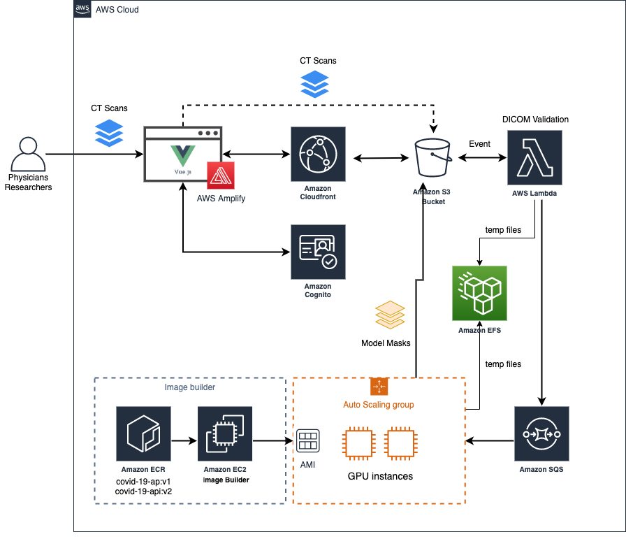

# L3-net Web Application
L3-net is not simply another COVID-19 detection model. We wanted to empower medical personnel with tools that would augment their ability to make decisions involving COVID-19 patients. L3-net is a clinically relevant approach to AI in medicine and is a continually evolving project that aims to provide quantitative measurements to radiologists. The team behind L3-net has worked closely with radiologists to identify the features and characteristics in CT scans that correlate most strongly with poor outcomes in patients. Every facet of the model has grown organically from the needs of the radiologists involved with this project. please visit the [L3-net Github](https://github.com/UBC-CIC/COVID19-L3-Net) for more information about the model

This repo contains the front and back-end to allow medical professionals around the world to easily upload CT-Scans and process them against the model to check opacity patterns in CT scans and receive a suggested prognostication. 

## Stack

* **Front-end** - Vue.js as the core framework, Quasar for UI, Amplify for Auth UI component and AWS integration. Users access Amazon CloudFront to access the files, which are stored at Amazon S3.
* **Data** - All data is saved in Amazon S3 and temporaraly at Amazon EFS. 
* **Auth** - Cognito provides JSON Web Tokens (JWT) and along with AppSync fine-grained authorization on what data types users can access.
* **Model** - The models were containarized and deployed to Amazon ECR public repositories. 
* **Image** - As part of the infrastructure build, a custom AMI is created with both models deployed in it to improve effeciency. 
* **Model Processing** - In the back-end, it was essential to create a cost-effective solution as it uses GPU machines to run the model. It is inspired by an [AWS blog post](https://aws.amazon.com/blogs/compute/running-cost-effective-queue-workers-with-amazon-sqs-and-amazon-ec2-spot-instances/), which describes how to dynamically run EC2 Spot instances in response to the SQS messages, pulling the model docker image from Amazon Elastic Container Repository.
* **Model Visualization** - Javascript plug-in displays the CT Scan image slices with the model results overlaid on top. 

## High level architecture

## User interface

# Deployment
To deploy this solution into your AWS Account please follow our [Deployment Guide](./docs/deployment_guide.md)

# Authors
The key contributors to this repository are Artur Rodrigues a Senior Solutions Architect from the AWS, Tim Esler and Brian Lee of Sapien ML.

# Changelog
* Jul 13, 2020: Initial release.

# License
This project is distributed under the  [Apache License 2.0](https://github.com/UBC-CIC/vgh-covid-19-ct-model/blob/master/LICENSE) 

