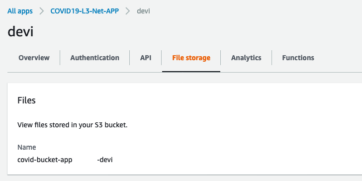
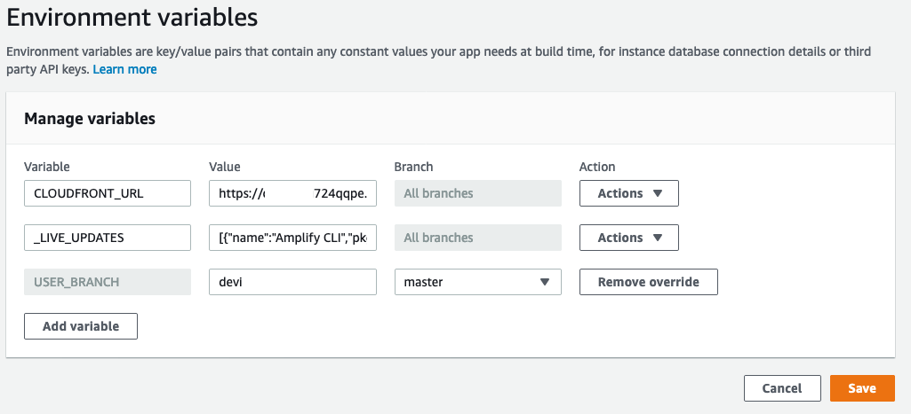

# Requirements
Before you deploy, you must have the following in place:
*  [AWS Account](https://aws.amazon.com/account/) 
*  [GitHub Account](https://github.com/) 
*  [Node 10 or greater](https://nodejs.org/en/download/) 
*  [Amplify CLI 4.13.1 or greater installed and configured](https://aws-amplify.github.io/docs/cli-toolchain/quickstart#quickstart) 

For prototyping, you need the following:
*  [Python 3.7 or greater](https://realpython.com/installing-python/) 
*  [SAM CLI](https://docs.aws.amazon.com/serverless-application-model/latest/developerguide/serverless-sam-cli-install.html) 
*  [Docker](https://docs.docker.com/install/) 


# Step 1: Front-end Deployment
In this step we will use the Amplify console to deploy and build the front-end application automatically. 

[](https://console.aws.amazon.com/amplify/home#/deploy?repo=https://github.com/UBC-CIC/COVID19-L3-Net-APP)

1. **1-click deployment** button above. Make sure to start the deployment before continuing. 
2. Go to the [Amplify Console](https://console.aws.amazon.com/amplify/home) 
3. Select the **COVID19-L3-Net-APP** app
4. Wait until **Provision, Build, Deploy and Verify** are all green. 
5. Click on the **Backend environments** tab
6. Click on **File storage** 
7. Copy the bucket name Amplify created. You will need this information for Deploying your backend application.




# Step 2: Deploy the SQS and EC2 infrastructure
In this step, we will deploy all the base back-end infrastructure to process the images as they land on S3. 

:warning: Important Note: The AmazonLinuxAMI ID for the region you are deploying the cloud formation can be found by executing the following command.  Please copy the AMI ID to be used on the next steps. **Make sure run this command on the region you are executing the solution.**
```bash
aws ec2 describe-images \
    --owners amazon \
    --filters 'Name=name,Values=Deep Learning Base AMI (Amazon Linux 2)*' 'Name=state,Values=available' \
    --query 'reverse(sort_by(Images, &CreationDate))[:1].ImageId' \
    --output text
```

1. Clone the repo.
2. Log into the  [CloudFormation Management Console](https://console.aws.amazon.com/cloudformation/home) .
3. Select **Create stack** with the _With new resources_ option.
4. Click _Upload a template file_, and then **Choose file** and select the <strong>backend_sqs-ec2_sqs-ec2-asg.yaml</strong>
5. Click _Next_.
6. Give the **Stack name** a name (e.g. **L3backend**). Select a key-pair and leave all the other fields with the default values. If you don’t have any Amazon EC2 key-pair available  [Create-your-key-pair](https://docs.aws.amazon.com/AWSEC2/latest/UserGuide/ec2-key-pairs.html#having-ec2-create-your-key-pair) , and repeat this step.
7. On the S3Bucket field past the bucket name obtained on the step 1.
8. On the AmazonLinixAMI past the AMI ID from the command listed at the beginning of Step 2.


9. Click Next twice. Don’t forget to check the checkbox for **I acknowledge that AWS CloudFormation might create IAM resources.** as the cloudformation creates a role for the EC2 instance that grants you access to all resources/services required during the workshop.
10. Once the deploy successfully finishes. Go to the Output tab and copy the cloudFrontDomain and sqsQueueName.


# Step 3: Deploy the Lambdas
## 3.1: Creating the Pydicom Layer
When a CT-Scan is submitted to be processed, a Lambda function is triggered to make sure that all files within the ZIP file are DICOM files. For this verification we leverage [Pydicom](https://pydicom.github.io/).  The first step to get this Lambda Function implemented is to create the Layer file. 

📓 **Note**: If you haven’t cloned the repo yet, this step and the next require the files to be local in your computer.

1. Go to the directory <strong>/backend/layers</strong> and execute:
```bash
createLayer.sh 
```
2. The command launches docker to retrieve Pydicom and create the layer file to be used on the lambda function. At the end, a file called pydicom.zip, with approximately 35GB, is going to created on the same directory.
3. Go the directory <strong>/backend/</strong> and execute the command below using the bucket name obtained on Step1:
```bash
sam package --s3-bucket <bucket> --output-template-file out.yaml 
```

4. To deploy the lambda function use the command below. Make sure you provide a stack name and replace the **ParameterValue** for s3Bucket and sqsName
```bash
sam deploy --template-file out.yaml --capabilities CAPABILITY_IAM CAPABILITY_AUTO_EXPAND --stack-name <stackName> --parameter-overrides ParameterKey=s3Bucket,ParameterValue=<bucket> ParameterKey=queueName,ParameterValue=<sqsName>
```

5. Go to the [Amplify Console](https://console.aws.amazon.com/amplify/home), select the COVID19-L3-Net-APP and go to **Environment variables**. Add a new variable called *CLOUDFRONT_URL* with the vaule of https://<cloudFrontDomain>



6. For editing building, choose App Settings, then choose Build settings. Then, In the App build specification section, choose Edit. More information in how to do it at this [link](https://docs.aws.amazon.com/amplify/latest/userguide/environment-variables.html)

7. Replace the build file with the following lines 
```
version: 1
backend:
  phases:
    build:
      commands:
        - '# Execute Amplify CLI with the helper script'
        - amplifyPush --simple
frontend:
  phases:
    preBuild:
      commands:
        - npm ci
    build:
      commands:
        - pwd
        - echo VUE_APP_CLOUDFRONT_URL=\"$CLOUDFRONT_URL\" > .env
        - echo VUE_APP_MAX_UPLOAD_SIZE_BYTES=524288000 >> .env
        - cat .env
        - npm run build
  artifacts:
    baseDirectory: dist
    files:
      - '**/*'
  cache:
    paths:
      - node_modules/**/*
```

 8. Redeploy the Application. Go to **master** and click on **Redeply this version** so the variable can take effect.
 
